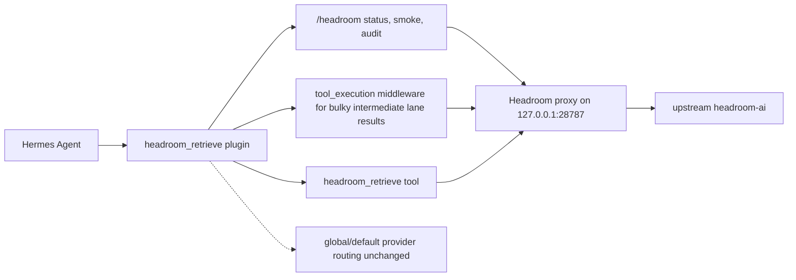

# Hermes Headroom Plugin

[](https://github.com/arotonal-ai/hermes-headroom-plugin/actions/workflows/ci.yml)
[](https://github.com/arotonal-ai/hermes-headroom-plugin/actions/workflows/runtime-smoke.yml)


**Installable Hermes Agent plugin for safe Headroom context reduction and exact CCR retrieval.**

Use it when a Hermes instance needs a conservative bridge to Headroom: install the Hermes plugin surface first, verify the optional local proxy separately, compress only eligible bulky intermediate tool/lane results, and keep finals, secrets, patches, manifests, memory, and protected content exact or blocked.

```bash
hermes plugins install arotonal-ai/hermes-headroom-plugin --enable
hermes gateway restart   # or /new in an active session
```

Then in Hermes:

```text
/headroom status
```

If a local Headroom proxy is running:

```text
/headroom smoke
```

## Why this exists

Hermes can benefit from context reduction, but a context/cost layer must be safe by default. This plugin packages Headroom retrieval/status/smoke plus a fail-open `tool_execution` middleware for eligible bulky intermediate tool/lane results, without mutating global provider routing or asking for secrets.

| Problem | What this repo provides |
|---|---|
| Agents lose exact details behind compressed context | `headroom_retrieve` tool for CCR marker recovery |
| Operators confuse plugin install with proxy/runtime readiness | explicit `INSTALL_PASS`, `RUNTIME_PARTIAL`, `RUNTIME_FULL` states |
| Windows/macOS/Linux installs drift by Python/runtime | portable helpers plus real OS/Python runtime smoke workflow |
| Remote proxy endpoints can leak intermediate content | loopback-only default; remote proxy requires explicit opt-in |
| Human/agent docs become long and ambiguous | quickstart, install guide, agent brief, audit script, temp-home tests |
| Cost/savings claims can become hand-wavy | metrics must be generated from JSONL evidence, not invented |

## What you get

| Capability | Status | Notes |
|---|---:|---|
| `headroom_retrieve` Hermes tool | ✅ included | retrieves exact content behind CCR markers |
| `/headroom status` | ✅ included | reports configured proxy URL and readiness |
| `/headroom smoke` | ✅ included | real compress → retrieve sentinel check when proxy is available |
| `/headroom audit` | ✅ included | local policy/runtime posture summary |
| Conservative admission policy | ✅ included | exact/compressible/blocked classification scaffolding |
| Bundled operating skill | ✅ included | `headroom_retrieve:headroom-token-cost-evaluation` when plugin skills are supported |
| Full upstream proxy runtime smoke | ✅ included | `scripts/test-headroom-runtime-smoke.py` and GitHub Runtime Smoke workflow |
| Remote proxy guardrail | ✅ included | non-loopback blocked unless explicitly allowed |
| Eligible bulky tool/lane result compression | ✅ included | `tool_execution` middleware compresses large intermediate results such as `delegate_task`, terminal/process, browser/debug, web_extract, and session_search when proxy is healthy |
| Worker/background/preflight CLI wrappers | 🚧 pending | owner-local wrapper scripts are not claimed as packaged behavior until migrated/tested here |
| Global/default provider route mutation | ❌ not included | install does not change model/provider defaults |
| External telemetry/API keys | ❌ not included | no telemetry, no keys required |

## Installation paths

### Recommended: native Hermes plugin install

```bash
hermes plugins install arotonal-ai/hermes-headroom-plugin --enable
hermes plugins list --enabled --user --plain
hermes gateway restart
```

For an active CLI/chat session, start a fresh session with `/new` after install.

Expected first verification:

```text
/headroom status
```

If this responds, the plugin has loaded. A missing proxy is `RUNTIME_PARTIAL`, not an install failure.

### Production: install the Headroom proxy runtime

`hermes plugins install ... --enable` installs only the Hermes surface. It does **not** install or supervise the upstream Headroom runtime. For `RUNTIME_FULL`, run the production runtime installer from a repo/plugin checkout:

```bash
python scripts/install-production-runtime.py
# or on Unix/Git Bash:
scripts/install-production-runtime.sh
```

The installer creates/updates a persistent venv at `~/.cache/hermes-headroom-venv`, installs the latest available `headroom-ai[proxy]` by default, starts `headroom proxy --host 127.0.0.1 --port 28787` if no proxy is ready, waits for `/readyz`, and runs a real plugin compress → retrieve smoke. It reports `RUNTIME_FULL` only when that end-to-end check passes.

Windows PowerShell uses the same Python helper:

```powershell
python scripts\install-production-runtime.py
# or, if python is not resolved correctly:
py -3 scripts\install-production-runtime.py
```

Manual fallback:

```bash
python3 -m venv ~/.cache/hermes-headroom-venv
~/.cache/hermes-headroom-venv/bin/python -m pip install --upgrade pip
~/.cache/hermes-headroom-venv/bin/python -m pip install 'headroom-ai[proxy]'
~/.cache/hermes-headroom-venv/bin/headroom proxy --host 127.0.0.1 --port 28787
```

Then in Hermes:

```text
/headroom smoke
```

## Acceptance states

| State | Meaning | Evidence |
|---|---|---|
| `INSTALL_PASS` | Hermes installed and loaded the plugin | `headroom_retrieve` enabled and `/headroom status` responds after restart/new session |
| `RUNTIME_PARTIAL` | Plugin works, proxy unavailable | `/headroom status` reports unavailable or `/headroom smoke` fails at `readyz` |
| `RUNTIME_FULL` | Plugin, dependency, and local proxy all work | dependency smoke passes and `/headroom smoke` or runtime-smoke sentinel retrieval passes |
| `FAIL` | Plugin not usable | plugin not enabled, `/headroom` unavailable after restart/new session, or install required copying owner-local state |

## Certified runtime matrix

The normal CI validates plugin load/tests. The separate Runtime Smoke workflow starts a real loopback Headroom proxy and validates compress → retrieve.

| OS | Python | Plugin CI | Runtime Smoke |
|---|---:|---:|---:|
| Ubuntu | 3.11 | ✅ | ✅ |
| Ubuntu | 3.12 | — | ✅ |
| macOS | 3.11 | ✅ | ✅ |
| macOS | 3.12 | — | ✅ |
| Windows native | 3.11 | ✅ | ✅ |
| Windows native | 3.12 | — | ✅ |
| WSL2 | target evidence required | 🟡 expected | 🟡 expected |
| Termux | target evidence required | 🟡 expected | 🟡 expected |

Legend: ✅ verified in this repo/workflow, 🟡 expected but not certified here. Python 3.13/3.14 are tracked by the non-blocking Future Runtime Monitor and are not certified until promoted through Runtime Smoke. See [docs/compatibility.md](docs/compatibility.md).

## Agent quick contract

If you are another Hermes/AI instance installing or auditing this repo:

1. Do **not** copy another machine's `~/.hermes` or owner-local state.
2. Do **not** ask for API keys; this install does not need them.
3. Install with native Hermes plugin commands first.
4. Verify `/headroom status` before claiming `INSTALL_PASS`.
5. Verify `scripts/test-headroom-runtime-smoke.py` or `/headroom smoke` before claiming `RUNTIME_FULL`.
6. Keep global/default provider routing unchanged.
7. Keep remote proxies disabled unless explicitly allowed by the operator.
8. Do not invent token-savings metrics.

Compact agent brief: [docs/AGENT-INSTALL.md](docs/AGENT-INSTALL.md). Full install/troubleshooting: [INSTALL.md](INSTALL.md).

## Validation helpers

From a clone, without touching a real Hermes profile:

```bash
scripts/audit-repo-readiness.sh
scripts/test-clean-hermes-install.sh --local
python scripts/test-headroom-dependency-install.py
python scripts/test-headroom-runtime-smoke.py
python scripts/install-production-runtime.py --no-start
```

Unix/Git Bash wrapper for dependency smoke:

```bash
scripts/test-headroom-dependency-install.sh
```

The runtime smoke creates a temporary venv, installs `headroom-ai[proxy]`, starts a local proxy on a free loopback port, then runs plugin compress/retrieve sentinel verification.

## Configuration

Default plugin proxy URL:

```text
http://127.0.0.1:28787
```

This is the Hermes plugin/runtime convention used by this integration. Do not rely on the upstream `headroom proxy` default port; production commands pass `--port 28787` explicitly so `/headroom status`, `tool_execution`, and `/headroom smoke` all target the same endpoint.

Environment override:

```bash
export HEADROOM_PROXY_URL="http://127.0.0.1:28787"
```

Hermes config override:

```yaml
context_reduction:
  proxy_url: http://127.0.0.1:28787
```

Remote proxy guardrail:

```bash
# Required only for controlled non-loopback proxy endpoints:
export HEADROOM_ALLOW_REMOTE_PROXY=1
```

or:

```yaml
context_reduction:
  allow_remote_proxy: true
```

Use remote proxies only for controlled, trusted endpoints; future compression wrappers may send intermediate content to the proxy.

## Architecture



## Relationship to upstream Headroom

This is a **Hermes Agent integration plugin** for Headroom. It is not the upstream Headroom project, not a fork, and not a replacement.

| Resource | Link |
|---|---|
| Upstream Headroom repo | <https://github.com/chopratejas/headroom> |
| Upstream docs | <https://headroom-docs.vercel.app/docs> |
| Alternate/legacy docs | <https://headroomlabs-ai.github.io/headroom/> |
| Python package | <https://pypi.org/project/headroom-ai/> |
| Hermes plugin docs | <https://hermes-agent.nousresearch.com/docs/user-guide/features/plugins> |
| Build a Hermes plugin | <https://hermes-agent.nousresearch.com/docs/guides/build-a-hermes-plugin> |
| Hermes install docs | <https://hermes-agent.nousresearch.com/docs/getting-started/installation> |

Acknowledgement: this plugin builds on the Headroom project's context-reduction ideas and Python package surface. The Hermes-specific work here is the installable plugin wrapper, safe admission policy, retrieval command, smoke/audit commands, and human/agent installation harnesses. See [ACKNOWLEDGEMENTS.md](ACKNOWLEDGEMENTS.md).

## Metrics and savings

Published savings must come from retained evidence, not manual estimates. Weekly rollups live in [docs/metrics/weekly-savings.md](docs/metrics/weekly-savings.md).

```bash
python scripts/generate-weekly-savings-table.py --input docs/metrics/data/*.jsonl --write docs/metrics/weekly-savings.md
```

If no evidence exists, the metrics page intentionally shows placeholders instead of invented numbers.

## Development checks

```bash
PYTHONPATH=src python3 -m unittest discover -s tests -v
python3 -m py_compile $(find src tests scripts -name '*.py' | sort)
bash -n scripts/*.sh
scripts/audit-repo-readiness.sh
python scripts/test-headroom-runtime-smoke.py
```

## Documentation map

- [INSTALL.md](INSTALL.md) — full install, update, rollback, proxy config, troubleshooting.
- [AGENTS.md](AGENTS.md) — repository-level instructions for AI/Hermes agents.
- [docs/AGENT-INSTALL.md](docs/AGENT-INSTALL.md) — compact agent install brief.
- [docs/compatibility.md](docs/compatibility.md) — certified vs experimental OS/Python/runtime support.
- [SECURITY.md](SECURITY.md) — security reporting and secret-handling policy.
- [PRIVACY.md](PRIVACY.md) — privacy and telemetry posture.
- [CHANGELOG.md](CHANGELOG.md) — release notes.
- [docs/metrics/weekly-savings.md](docs/metrics/weekly-savings.md) — evidence-backed savings rollups.
- `scripts/test-headroom-runtime-smoke.py` — real loopback proxy + plugin compress/retrieve smoke.
- `.github/workflows/runtime-smoke.yml` — manual/weekly real proxy runtime certification across OS/Python matrix.
- `.github/workflows/future-runtime-monitor.yml` — non-blocking Python 3.13/3.14 drift monitor.

## Non-goals in this repo stage

- No global/default provider proxy routing.
- No external telemetry.
- No automatic compression of final answers, patches/diffs, manifests, hashes, secrets, memory, profile, system/developer instructions, or protected content.
- No claim that owner-local experimental wrappers are packaged production behavior.
