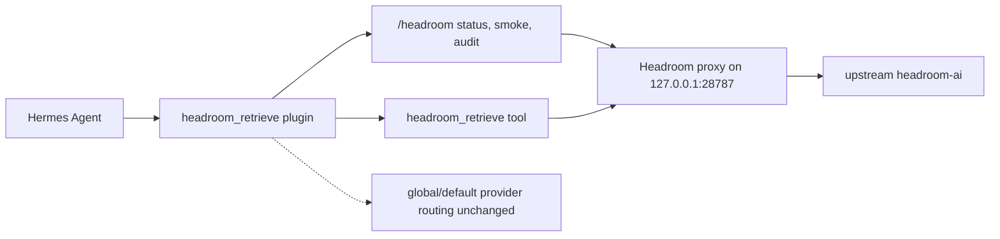

# Hermes Headroom Plugin

[](https://github.com/arotonal-ai/hermes-headroom-plugin/actions/workflows/ci.yml)


Native Hermes plugin for safe Headroom context reduction: install the Hermes surface first, verify the optional proxy later, and never compress final/sensitive artifacts.

> **Primary install path:** install from another Hermes instance with `hermes plugins install arotonal-ai/hermes-headroom-plugin --enable`.

## Relationship to upstream Headroom

This repository is a **Hermes Agent integration plugin** for Headroom. It is not the upstream Headroom project, not a fork, and not a replacement.

Upstream resources:

| Resource | Link |
|---|---|
| Upstream Headroom repo | <https://github.com/chopratejas/headroom> |
| Upstream docs | <https://headroom-docs.vercel.app/docs> |
| Alternate/legacy docs | <https://headroomlabs-ai.github.io/headroom/> |
| Python package | <https://pypi.org/project/headroom-ai/> |
| Hermes plugin docs | <https://hermes-agent.nousresearch.com/docs/user-guide/features/plugins> |
| Build a Hermes plugin | <https://hermes-agent.nousresearch.com/docs/guides/build-a-hermes-plugin> |
| Hermes install docs | <https://hermes-agent.nousresearch.com/docs/getting-started/installation> |

Acknowledgement: this plugin builds on the Headroom project's context-reduction ideas and Python package surface. The Hermes-specific work here is the installable plugin wrapper, safe admission policy, retrieval command, smoke/audit commands, and agent/human installation harnesses. See [ACKNOWLEDGEMENTS.md](ACKNOWLEDGEMENTS.md).

## What you get

| Capability | Status | Notes |
|---|---:|---|
| `headroom_retrieve` Hermes tool | ✅ included | Retrieves exact content behind CCR markers |
| `/headroom status` | ✅ included | Checks configured/local proxy readiness |
| `/headroom smoke` | ✅ included | Synthetic compress → retrieve sentinel when proxy is available |
| `/headroom audit` | ✅ included | Local health/policy posture summary |
| Conservative exact/compress/blocked policy | ✅ included | Fails closed for final/sensitive classes |
| Bundled Headroom operating skill | ✅ included | Registered when Hermes supports plugin skills |
| Worker/background/preflight wrappers | 🚧 pending P1 | Console entry points exist, implementation intentionally not migrated yet |
| Cost/provider route mutation | 🚧 pending P3 | Current repo does **not** change global/default routing |
| External telemetry | ❌ not included | Off by design |

## Install for a target Hermes instance

Use this copy/paste path when the owner or target instance wants the plugin enabled first and the optional Headroom runtime verified second.

### 1. Install the Hermes plugin

```bash
hermes plugins install arotonal-ai/hermes-headroom-plugin --enable
hermes plugins list --enabled --user --plain
hermes gateway restart   # gateway/platform sessions
# or start a fresh active chat/CLI session with /new
```

Then verify inside Hermes:

```text
/headroom status
```

If this command responds, the plugin install succeeded. A missing proxy is a partial runtime state, not a failed plugin install.

### 2. Optional: install and run the Headroom proxy

The plugin can load without the upstream Headroom runtime. For real compression, install the upstream package in an isolated virtual environment and start a local proxy.

Unix/macOS/WSL example:

```bash
python3 -m venv ~/.cache/hermes-headroom-venv
~/.cache/hermes-headroom-venv/bin/python -m pip install --upgrade pip
~/.cache/hermes-headroom-venv/bin/python -m pip install 'headroom-ai[proxy]>=0.26,<0.27'
~/.cache/hermes-headroom-venv/bin/headroom proxy --host 127.0.0.1 --port 28787
```

Windows PowerShell example:

```powershell
py -m venv $env:USERPROFILE\.cache\hermes-headroom-venv
& $env:USERPROFILE\.cache\hermes-headroom-venv\Scripts\python.exe -m pip install --upgrade pip
& $env:USERPROFILE\.cache\hermes-headroom-venv\Scripts\python.exe -m pip install 'headroom-ai[proxy]>=0.26,<0.27'
& $env:USERPROFILE\.cache\hermes-headroom-venv\Scripts\headroom.exe proxy --host 127.0.0.1 --port 28787
```

With the proxy running, verify inside Hermes:

```text
/headroom smoke
```

## Expected states

| State | What it means | Expected result |
|---|---|---|
| `INSTALL_PASS` | Hermes installed and loaded the plugin | `headroom_retrieve` appears enabled; `/headroom status` responds |
| `RUNTIME_PARTIAL` | Plugin is installed but no Headroom proxy is reachable | `/headroom status` reports unavailable, or `/headroom smoke` fails at `readyz` |
| `RUNTIME_FULL` | Plugin, upstream dependency, and proxy all work | dependency smoke passes and `/headroom smoke` passes a real compress → retrieve sentinel check |
| `FAIL` | Plugin cannot be used | plugin is not enabled, `/headroom` is unavailable after restart/new session, or install required copying owner-local state |

See [INSTALL.md](INSTALL.md) for update, rollback, temporary-home testing, and troubleshooting.

## Platform support posture

The plugin is platform-neutral Python/Hermes code. Bash helpers are Unix-shell first; Python helpers and native `hermes` commands are preferred for Windows.

| Platform | Plugin install | Helper scripts | Proxy runtime | CI status |
|---|---:|---:|---:|---:|
| Linux | ✅ tested | ✅ Bash + Python | ✅ expected | ✅ |
| WSL2 | 🟡 expected | 🟡 Bash + Python | 🟡 expected | ❌ not explicit |
| macOS | 🟡 expected | 🟡 Bash + Python | 🟡 expected | ✅ syntax/helper matrix |
| Windows native | 🟡 possible via Hermes | 🟡 Python helpers; Bash needs Git Bash/WSL | 🟡 upstream package is OS-independent | ✅ syntax/helper matrix |
| Termux | 🟡 expected if Hermes/Python/git work | 🟡 expected | 🟡 expected | ❌ not explicit |

Legend: ✅ tested/certified here, 🟡 expected but still needs target evidence, ❌ not claimed.

## Prerequisites and dependency layers

| Requirement | Needed for | Note | Link |
|---|---|---|---|
| Hermes Agent | Plugin install/load | Installed and on `PATH` | <https://hermes-agent.nousresearch.com/docs/getting-started/installation> |
| Git | Native `hermes plugins install owner/repo` | Required by the native plugin install path | <https://git-scm.com/downloads> |
| Python | Package/scripts/proxy | Use a supported Python for Hermes/plugin and upstream Headroom | <https://www.python.org/downloads/> |
| `headroom-ai[proxy]` | Actual compression proxy/backend | Install only for `RUNTIME_FULL`; smoke before changing the dependency spec | <https://pypi.org/project/headroom-ai/> |
| Local proxy | `/headroom smoke` / real compression | Plugin default target: `http://127.0.0.1:28787` | [INSTALL.md](INSTALL.md) |
| API keys | Not needed | Install should not request secrets | [SECURITY.md](SECURITY.md), [PRIVACY.md](PRIVACY.md) |

Layer split:

| Layer | Command | Required for |
|---|---|---|
| Hermes plugin | `hermes plugins install arotonal-ai/hermes-headroom-plugin --enable` | `INSTALL_PASS`: Hermes can load `headroom_retrieve` and `/headroom status` |
| Upstream Headroom package | `python -m pip install 'headroom-ai[proxy]>=0.26,<0.27'` | local proxy/backend |
| Runtime proxy | `headroom proxy --host 127.0.0.1 --port 28787` | `RUNTIME_FULL`: `/headroom smoke` can compress → retrieve |

Validate the dependency layer without touching Hermes or system Python:

```bash
python scripts/test-headroom-dependency-install.py
# or the Unix shell wrapper:
scripts/test-headroom-dependency-install.sh
```

After native Hermes install, the same check is available from the installed plugin directory:

```bash
"${HERMES_HOME:-$HOME/.hermes}/plugins/headroom_retrieve/scripts/test-headroom-dependency-install.sh"
```

## Architecture



## Safe defaults

```text
Headroom = bounded context-reduction for eligible intermediates
not = global/default provider proxy routing
```

Defaults:

- plugin disabled until explicitly enabled by Hermes install command;
- no global/default provider routing;
- no external telemetry;
- secrets, memory, profile, system/developer instructions, patches, diffs, manifests, hashes, claim ledgers, final packets, and protected content are exact or blocked, not compressed;
- routing/canary/provider-cost features are opt-in advanced work, not first-install behavior.

## Install paths

### Recommended: native Hermes Git plugin

```bash
hermes plugins install arotonal-ai/hermes-headroom-plugin --enable
hermes plugins list --enabled --user --plain
hermes gateway restart
```

This clones the repo under the target Hermes home, enables `headroom_retrieve`, and makes the slash command available after a fresh session/restart.

### Local checkout / development

```bash
git clone https://github.com/arotonal-ai/hermes-headroom-plugin.git
cd hermes-headroom-plugin
scripts/install-hermes-plugin.sh --local
scripts/verify-hermes-install.sh
```

### Python package / entry point path

The package also declares:

```toml
[project.entry-points."hermes_agent.plugins"]
headroom_retrieve = "hermes_headroom_plugin"
```

Use this path only when you intentionally install into the same Python environment that runs Hermes:

```bash
python -m pip install git+https://github.com/arotonal-ai/hermes-headroom-plugin.git
hermes plugins enable headroom_retrieve
hermes gateway restart
```

For most Hermes users, prefer `hermes plugins install`.

## Verification without touching the real Hermes profile

Read-only repo audit:

```bash
scripts/audit-repo-readiness.sh
```

Temporary `HERMES_HOME` install test:

```bash
scripts/test-clean-hermes-install.sh --local
```

Maintainers can test the remote install path with a temporary home:

```bash
TMP_HOME="$(mktemp -d)"
HERMES_HOME="$TMP_HOME" hermes plugins install arotonal-ai/hermes-headroom-plugin --enable
HERMES_HOME="$TMP_HOME" hermes plugins list --enabled --user --plain
rm -rf "$TMP_HOME"
```

A passing install shows `headroom_retrieve` enabled.

## Metrics and savings

Published savings must come from retained evidence, not hand-entered claims. Weekly rollups start on Monday and live in [docs/metrics/weekly-savings.md](docs/metrics/weekly-savings.md).

Generate a table from JSONL evidence:

```bash
python scripts/generate-weekly-savings-table.py --input docs/metrics/data/*.jsonl --write docs/metrics/weekly-savings.md
```

If no evidence exists, the metrics page intentionally shows placeholders instead of invented numbers.

## Local development checks

```bash
PYTHONPATH=src python3 -m unittest discover -s tests -v
python3 -m py_compile $(find src tests scripts -name '*.py' | sort)
bash -n scripts/*.sh
scripts/audit-repo-readiness.sh
```

Verify upstream Headroom dependency in a temporary venv:

```bash
python scripts/test-headroom-dependency-install.py
```

If a local proxy is running:

```bash
python3 src/hermes_headroom_plugin/proxy.py smoke --json
```

## Documentation

- [AGENTS.md](AGENTS.md) — root instructions for another Hermes/AI agent.
- [INSTALL.md](INSTALL.md) — complete installation, verification, update, rollback, and troubleshooting guide.
- [docs/AGENT-INSTALL.md](docs/AGENT-INSTALL.md) — compact install brief for agents.
- [docs/metrics/weekly-savings.md](docs/metrics/weekly-savings.md) — evidence-backed savings rollups.
- [SECURITY.md](SECURITY.md) — security reporting and secret-handling policy.
- [PRIVACY.md](PRIVACY.md) — privacy and telemetry posture.

## Non-goals in this repo stage

- No default/global provider proxy route.
- No owner profile/session/memory/project evidence copied into package payload.
- No external telemetry.
- No compression of patches, diffs, manifests, hashes, claim ledgers, final packets, secrets, memory/profile/system/developer instructions, or protected content.
