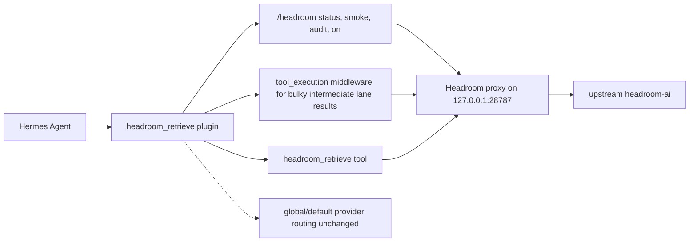

# Hermes Headroom Plugin

[](https://github.com/arotonal-ai/hermes-headroom-plugin/actions/workflows/ci.yml)
[](https://github.com/arotonal-ai/hermes-headroom-plugin/actions/workflows/runtime-smoke.yml)


**Installable Hermes Agent plugin for safe Headroom context reduction and exact CCR retrieval.**

Use it when a Hermes instance needs a conservative bridge to Headroom: install the Hermes plugin surface first, then install or point it at a local Headroom runtime for actual compression. The plugin **does not compress by itself**; it calls the configured Headroom proxy for `/v1/compress`, `/v1/retrieve`, stats, and smoke tests. Without that runtime it is limited to install/status/readiness surfaces and fails open to exact outputs.

```bash
hermes plugins install arotonal-ai/hermes-headroom-plugin --enable
hermes gateway restart   # or /new in an active session
```

Then in Hermes:

```text
/headroom status
/headroom on      # read-only compatibility check; does not mutate runtime/provider state
```

After the Headroom runtime/proxy is installed and healthy:

```text
/headroom smoke
```

## Why this exists

Hermes can benefit from context reduction, but a context/cost layer must be safe by default. This plugin packages the Hermes-side bridge: retrieval/status/smoke commands, runtime guardrails, bundled operating skill, and fail-open `tool_execution` middleware for eligible bulky intermediate tool/lane results. Actual compression/retrieval is performed by the upstream Headroom runtime behind the configured proxy; the plugin never mutates global provider routing or asks for secrets.

| Problem | What this repo provides |
|---|---|
| Agents lose exact details behind compressed context | `headroom_retrieve` tool for CCR marker recovery |
| Operators confuse plugin install with proxy/runtime readiness | explicit `INSTALL_PASS`, `RUNTIME_PARTIAL`, `RUNTIME_FULL` states |
| Windows/macOS/Linux installs drift by Python/runtime | portable helpers plus real OS/Python runtime smoke workflow |
| Remote proxy endpoints can leak intermediate content | loopback-only default; remote proxy requires explicit opt-in |
| Human/agent docs become long and ambiguous | quickstart, install guide, agent brief, audit script, temp-home tests |
| Cost/savings claims can become hand-wavy | metrics must be generated from JSONL evidence, not invented |

## What you get

| Capability | Status | Notes |
|---|---:|---|
| `headroom_retrieve` Hermes tool | ✅ included | retrieves exact content behind CCR markers |
| `/headroom status` | ✅ plugin-only | reports configured proxy URL and readiness; does not compress |
| `/headroom on` | ✅ plugin-only | read-only compatibility/readiness check; does not start or mutate runtime |
| `/headroom smoke` | ✅ requires runtime | real compress → retrieve sentinel check through the configured Headroom proxy |
| `/headroom audit` | ✅ plugin-only + runtime-aware | local policy/runtime posture summary |
| `/headroom cache` | ✅ runtime read-only | reports runtime-owned CCR store/cache entries, TTL, backend, usage, and retrieval counts; the plugin has no independent CCR cache |
| Visible `[HR✓]` / `[HR!]` final-answer marker | ✅ included | reports proxy readiness only; disable with `context_reduction.visible_status_marker: false` if desired |
| Conservative admission policy | ✅ included | exact/compressible/blocked classification scaffolding |
| Bundled operating skill | ✅ included | `headroom_retrieve:headroom-token-cost-evaluation` when plugin skills are supported |
| Full upstream proxy runtime smoke | ✅ included | `scripts/test-headroom-runtime-smoke.py` and GitHub Runtime Smoke workflow |
| Remote proxy guardrail | ✅ included | non-loopback blocked unless explicitly allowed |
| Eligible bulky tool/lane result compression | ✅ requires runtime | `tool_execution` middleware calls the Headroom proxy to compress large intermediate results such as `delegate_task`, terminal/process, browser/debug, web_extract, and session_search when the proxy is healthy; otherwise it returns the exact original result |
| Context Economy Loop contract | ✅ documented | [docs/context-economy-loop.md](docs/context-economy-loop.md) describes portable observe → classify → act → verify → learn behavior without instance-specific state; the loop is a bounded decision protocol, not an autonomous meta-agent or background watcher |
| Worker/background/preflight CLI wrappers | ✅ require runtime for compression | wrappers retain exact sidecars/final packets; compression of eligible bulky intermediates happens only through a healthy Headroom proxy |
| Global/default provider route mutation | ❌ not included | install does not change model/provider defaults |
| External telemetry/API keys | ❌ not included | no telemetry, no keys required |

## Installation paths

### Recommended: native Hermes plugin install

```bash
hermes plugins install arotonal-ai/hermes-headroom-plugin --enable
hermes plugins list --enabled --user --plain
hermes gateway restart
```

For an active CLI/chat session, start a fresh session with `/new` after install.

Expected first verification:

```text
/headroom status
```

If this responds, the plugin has loaded. A missing proxy is `RUNTIME_PARTIAL`: useful for status/audit/readiness, but **not** a production context-reduction state because no real compression or retrieval can occur.

### Production: install the Headroom proxy runtime

`hermes plugins install ... --enable` installs only the Hermes surface. It does **not** install or supervise the upstream Headroom runtime. For any real compression/retrieval path — `/headroom smoke`, `headroom_retrieve`, `tool_execution` compression, and wrapper compression — a reachable Headroom proxy is required. For `RUNTIME_FULL`, run the production runtime installer from a repo/plugin checkout:

```bash
python scripts/install-production-runtime.py
# or on Unix/Git Bash:
scripts/install-production-runtime.sh
```

The installer creates/updates a persistent venv at `~/.cache/hermes-headroom-venv`, installs the bundled `llm-monitor` companion plugin into `$HERMES_HOME/plugins/llm-monitor` without restarting Hermes, installs the latest available `headroom-ai[proxy]` by default, starts `headroom proxy --host 127.0.0.1 --port 28787` if no proxy is ready, waits for `/readyz`, and runs a real plugin compress → retrieve smoke. It reports `RUNTIME_FULL` only when that end-to-end check passes. Existing local `llm-monitor` files are preserved unless `--force-llm-monitor-companion` is used; use `--skip-llm-monitor-companion` to opt out.

No-restart companion-only validation:

```bash
python scripts/install-production-runtime.py --companion-only --hermes-home /tmp/hermes-home --json
```

For a Linux Hermes gateway/default-cockpit deployment, use durable service mode instead of a detached helper process:

```bash
python scripts/install-production-runtime.py --systemd-user
systemctl --user is-enabled hermes-context-reduction.service
systemctl --user is-active hermes-context-reduction.service
```

That path reports `RUNTIME_FULL_DURABLE` only when the user service is enabled + active and the compress → retrieve smoke passes. Without `--systemd-user`, `RUNTIME_FULL` is process-level evidence, not proof that the proxy will survive a gateway restart/logout.

Windows PowerShell uses the same Python helper:

```powershell
python scripts\install-production-runtime.py
# or, if python is not resolved correctly:
py -3 scripts\install-production-runtime.py
```

Manual fallback:

```bash
python3 -m venv ~/.cache/hermes-headroom-venv
~/.cache/hermes-headroom-venv/bin/python -m pip install --upgrade pip
~/.cache/hermes-headroom-venv/bin/python -m pip install 'headroom-ai[proxy]'
~/.cache/hermes-headroom-venv/bin/headroom proxy --host 127.0.0.1 --port 28787
```

Then in Hermes:

```text
/headroom smoke
```

## Runtime boundary: plugin alone vs Headroom runtime

The plugin is the Hermes integration layer; the Headroom runtime is the compression/retrieval engine. Treat them as separate layers:

| Layer | Works without proxy? | What it covers |
|---|---:|---|
| Hermes plugin registration | ✅ | `headroom_retrieve` tool exists, `/headroom` command exists, bundled skill is discoverable, fail-open middleware is registered. |
| Status/audit/readiness | ✅ partial | `/headroom status`, `/headroom on`, and audit can report configuration/readiness; they do not compress. |
| `headroom_retrieve` exact CCR recovery | ❌ | Calls the proxy `/v1/retrieve`; without runtime it returns a clear proxy-not-ready/config error. |
| `/headroom smoke` | ❌ | Calls proxy `/readyz`, `/v1/compress`, then `/v1/retrieve`; PASS requires runtime. |
| `/headroom cache` / `/headroom runtime` | ❌ for store data | Read-only views of runtime health and retrieve/store stats; without runtime they can only report unavailable. |
| `tool_execution` result compression | ❌ | Middleware first checks proxy readiness, then calls `/v1/compress`; if unavailable or unsafe, it returns the exact original result. |
| Worker/background/preflight wrapper compression | ❌ | Wrappers retain exact sidecars regardless, but compression requires the proxy. |

So the runtime is “optional” only for install/status/audit/degraded operation. It is **required** for the product claim “Headroom context reduction is active.”

### Adoption benchmark for a new Hermes instance

Before promoting the Context Economy Loop as an always-used operating pattern in a new instance, run the bounded benchmark:

```bash
headroom-adoption-benchmark --samples 3 --format text
# or from this repository
PYTHONPATH=src python scripts/headroom-adoption-benchmark.py --samples 3 --format json
```

The benchmark returns one of three decisions:

| Decision | Meaning |
|---|---|
| `ADOPT_LOOP` | loop reporting appears worth its overhead; compression/retrieval quality passed |
| `COMPRESSION_ONLY` | keep plugin/runtime compression, but do not promote recurring loop reports yet |
| `DISABLE_LOOP_REPORTING` | do not adopt the loop/reporting layer until runtime, quality, or overhead is fixed |

This measures the evaluative layer, not whether the portable product should favor compression. Portable plugin behavior remains compression/savings-first by default.

### Scoped on-demand mode for plugin-development loops

Portable plugin behavior should continue to favor compression and savings by default. For this repo's own iterative development/debug loops, leave the runtime running but disable middleware auto-compression in the development process when repeated tests/gates make automatic trace compression more expensive than useful:

```bash
export HEADROOM_AUTO_COMPRESSION=0
```

Or in Hermes config:

```yaml
context_reduction:
  auto_compression: false
```

This is a scoped development-loop override, not a portable-product default. It keeps `/headroom status`, `/headroom smoke`, `/headroom cache`, and `headroom_retrieve` available, but tool outputs return exact unless explicitly compressed through a wrapper/runtime path. Use it for plugin improvement sessions with repeated tests/gates; keep `HEADROOM_AUTO_COMPRESSION=1` or `context_reduction.auto_compression: true` for normal portable operation where eligible-intermediate compression is the point. The control disables only middleware auto-compression, not the runtime or the portable compression-first product posture.

### Cache / CCR store boundary

There is no separate plugin-side CCR cache. The cache/store that makes CCR markers retrievable belongs to the Headroom runtime/proxy. `/headroom cache` is read-only and reports the runtime store posture: entries, max entries, TTL, backend type, bytes used when the runtime exposes it, retrieval/event counts, and recent retrieval count. It does not purge, mutate, or expose admin/debug APIs.

Operationally: if the runtime cache TTL expires or the runtime store is cleared, old CCR markers may stop resolving through `headroom_retrieve`. The plugin still keeps local reports and redacted sidecars for audit where middleware created them, but those sidecars are not a replacement for the runtime CCR store when exact full recovery is required. Treat long-lived canonical/source material as exact, not cache-backed compressed context.

## Acceptance states

| State | Meaning | Evidence |
|---|---|---|
| `INSTALL_PASS` | Hermes installed and loaded the plugin | `headroom_retrieve` enabled and `/headroom status` responds after restart/new session |
| `RUNTIME_PARTIAL` | Plugin commands load, but proxy is unavailable | `/headroom status` reports unavailable or `/headroom smoke` fails at `readyz`; status/audit are usable, but compression/retrieval/middleware compression are not active |
| `RUNTIME_FULL` | Plugin, dependency, and local proxy all work in the current process/session | dependency smoke passes and `/headroom smoke` or runtime-smoke sentinel retrieval passes; eligible intermediate compression can run |
| `RUNTIME_FULL_DURABLE` | Linux user-service deployment survives gateway restart/logout | `python scripts/install-production-runtime.py --systemd-user` passes, `hermes-context-reduction.service` is `enabled` + `active`, and `/headroom smoke` passes |
| `FAIL` | Plugin not usable | plugin not enabled, `/headroom` unavailable after restart/new session, or install required copying owner-local state |

## Certified runtime matrix

The normal CI validates plugin load/tests. The separate Runtime Smoke workflow starts a real loopback Headroom proxy and validates compress → retrieve.

| OS | Python | Plugin CI | Runtime Smoke |
|---|---:|---:|---:|
| Ubuntu | 3.11 | ✅ | ✅ |
| Ubuntu | 3.12 | — | ✅ |
| macOS | 3.11 | ✅ | ✅ |
| macOS | 3.12 | — | ✅ |
| Windows native | 3.11 | ✅ | ✅ |
| Windows native | 3.12 | — | ✅ |
| WSL2 | target evidence required | 🟡 expected | 🟡 expected |
| Termux | target evidence required | 🟡 expected | 🟡 expected |

Legend: ✅ verified in this repo/workflow, 🟡 expected but not certified here. Python 3.13/3.14 are tracked by the non-blocking Future Runtime Monitor and are not certified until promoted through Runtime Smoke. See [docs/compatibility.md](docs/compatibility.md).

## Agent quick contract

If you are another Hermes/AI instance installing or auditing this repo:

1. Do **not** copy another machine's `~/.hermes` or owner-local state.
2. Do **not** ask for API keys; this install does not need them.
3. Install with native Hermes plugin commands first.
4. Verify `/headroom status` before claiming `INSTALL_PASS`.
5. Verify `scripts/test-headroom-runtime-smoke.py` or `/headroom smoke` before claiming `RUNTIME_FULL`. Use `/headroom cache` to inspect runtime-owned CCR store TTL/pressure when debugging marker retrieval.
6. Keep global/default provider routing unchanged.
7. Keep remote proxies disabled unless explicitly allowed by the operator.
8. Do not invent token-savings metrics.

Compact agent brief: [docs/AGENT-INSTALL.md](docs/AGENT-INSTALL.md). Context-economy loop contract: [docs/context-economy-loop.md](docs/context-economy-loop.md). Full install/troubleshooting: [INSTALL.md](INSTALL.md).

## Validation helpers

From a clone, without touching a real Hermes profile:

```bash
scripts/audit-repo-readiness.sh
scripts/test-clean-hermes-install.sh --local
python scripts/test-headroom-dependency-install.py
python scripts/test-headroom-runtime-smoke.py
python scripts/context-economy-loop-gate.py
python scripts/install-production-runtime.py --no-start
```

Before owner review as a portable release candidate, run the local RC gate:

```bash
python scripts/release-candidate-local-gate.py
```

This writes evidence under `release-candidate-runs/` and must end with `PLUGIN_RELEASE_CANDIDATE_LOCAL_PASS` before any public release decision. See [docs/release-candidate.md](docs/release-candidate.md).

Unix/Git Bash wrapper for dependency smoke:

```bash
scripts/test-headroom-dependency-install.sh
```

The runtime smoke creates a temporary venv, installs `headroom-ai[proxy]`, starts a local proxy on a free loopback port, then runs plugin compress/retrieve sentinel verification.

## Packaged command wrappers

For explicit operator commands that may emit bulky intermediate logs, use the packaged wrappers:

```bash
headroom-command-preflight --expected-chars 80000 -- pytest tests
headroom-command-preflight --run --expected-chars 80000 -- pytest tests
headroom-worker-lane --lane tests --query "failures warnings verification" -- pytest tests
headroom-background-lane --lane build -- npm test
```

`headroom-worker-lane` and `headroom-background-lane` retain exact stdout/stderr sidecars and exact `worker-final-packet.md`; only eligible bulky intermediate traces are compressed through the configured loopback proxy. Oversized traces are bounded before compression with deterministic head + query-matching lines + tail input (`--max-compress-chars`, default 250k) while the exact full raw sidecar remains the source of truth. They do not change Hermes provider/model routing. Natural `hr-*` smart-route aliases and provider-routing helpers are not part of the packaged product surface.

## Configuration

Default plugin proxy URL:

```text
http://127.0.0.1:28787
```

This is the Hermes plugin/runtime convention used by this integration. Do not rely on the upstream `headroom proxy` default port; production commands pass `--port 28787` explicitly so `/headroom status`, `tool_execution`, and `/headroom smoke` all target the same endpoint.

Environment override:

```bash
export HEADROOM_PROXY_URL="http://127.0.0.1:28787"
```

Hermes config override:

```yaml
context_reduction:
  proxy_url: http://127.0.0.1:28787
```

Remote proxy guardrail:

```bash
# Required only for controlled non-loopback proxy endpoints:
export HEADROOM_ALLOW_REMOTE_PROXY=1
```

or:

```yaml
context_reduction:
  allow_remote_proxy: true
```

Use remote proxies only for controlled, trusted endpoints; future compression wrappers may send intermediate content to the proxy.

## Architecture


```mermaid
flowchart LR
  H["Hermes Agent"] --> P["headroom_retrieve plugin"]
  P --> C["/headroom status, smoke, audit, on"]
  P --> T["headroom_retrieve tool"]
  P --> M["tool_execution middleware for bulky intermediate lane results"]
  C --> X["Headroom proxy on 127.0.0.1:28787"]
  M --> X
  T --> X
  X --> U["upstream headroom-ai"]
  P -.-> R["global/default provider routing unchanged"]
```

## Relationship to upstream Headroom

This is a **Hermes Agent integration plugin** for Headroom. It is not the upstream Headroom project, not a fork, and not a replacement.

| Resource | Link |
|---|---|
| Upstream Headroom repo | <https://github.com/chopratejas/headroom> |
| Upstream docs | <https://headroom-docs.vercel.app/docs> |
| Alternate/legacy docs | <https://headroomlabs-ai.github.io/headroom/> |
| Python package | <https://pypi.org/project/headroom-ai/> |
| Hermes plugin docs | <https://hermes-agent.nousresearch.com/docs/user-guide/features/plugins> |
| Build a Hermes plugin | <https://hermes-agent.nousresearch.com/docs/guides/build-a-hermes-plugin> |
| Hermes install docs | <https://hermes-agent.nousresearch.com/docs/getting-started/installation> |

Acknowledgement: this plugin builds on the Headroom project's context-reduction ideas and Python package surface. The Hermes-specific work here is the installable plugin wrapper, safe admission policy, retrieval command, smoke/audit commands, and human/agent installation harnesses. See [ACKNOWLEDGEMENTS.md](ACKNOWLEDGEMENTS.md).

## Metrics and savings

Published savings must come from retained evidence, not manual estimates. Weekly rollups live in [docs/metrics/weekly-savings.md](docs/metrics/weekly-savings.md).

```bash
python scripts/generate-weekly-savings-table.py --input docs/metrics/data/*.jsonl --write docs/metrics/weekly-savings.md
```

If no evidence exists, the metrics page intentionally shows placeholders instead of invented numbers.

## Development checks

```bash
PYTHONPATH=src python3 -m unittest discover -s tests -v
python3 -m py_compile $(find src tests scripts -name '*.py' | sort)
bash -n scripts/*.sh
scripts/audit-repo-readiness.sh
python scripts/test-headroom-runtime-smoke.py
```

## Documentation map

- [INSTALL.md](INSTALL.md) — full install, update, rollback, proxy config, troubleshooting.
- [AGENTS.md](AGENTS.md) — repository-level instructions for AI/Hermes agents.
- [docs/AGENT-INSTALL.md](docs/AGENT-INSTALL.md) — compact agent install brief.
- [docs/compatibility.md](docs/compatibility.md) — certified vs experimental OS/Python/runtime support.
- [SECURITY.md](SECURITY.md) — security reporting and secret-handling policy.
- [PRIVACY.md](PRIVACY.md) — privacy and telemetry posture.
- [CHANGELOG.md](CHANGELOG.md) — release notes.
- [docs/metrics/weekly-savings.md](docs/metrics/weekly-savings.md) — evidence-backed savings rollups.
- `scripts/test-headroom-runtime-smoke.py` — real loopback proxy + plugin compress/retrieve smoke.
- `.github/workflows/runtime-smoke.yml` — manual/weekly real proxy runtime certification across OS/Python matrix.
- `.github/workflows/future-runtime-monitor.yml` — non-blocking Python 3.13/3.14 drift monitor.

## Non-goals in this repo stage

- No global/default provider proxy routing.
- No external telemetry.
- No automatic compression of final answers, patches/diffs, manifests, hashes, secrets, memory, profile, system/developer instructions, or protected content.
- No claim that owner-local experimental wrappers are packaged production behavior.
