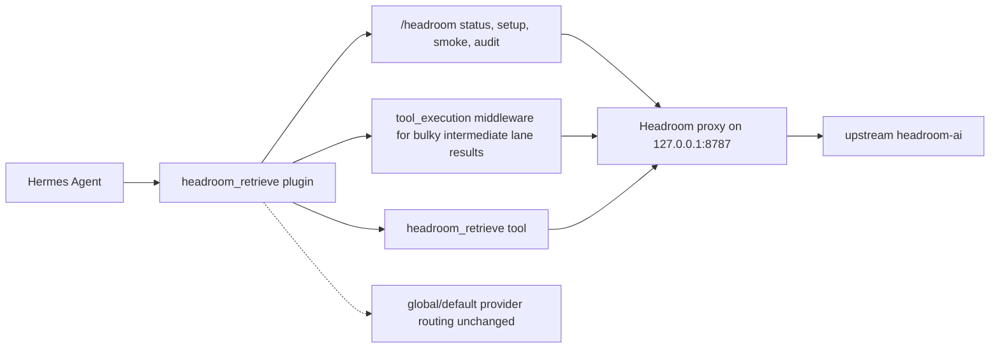

# Hermes Headroom Plugin

[](https://github.com/arotonal-ai/hermes-headroom-plugin/actions/workflows/ci.yml)
[](https://github.com/arotonal-ai/hermes-headroom-plugin/actions/workflows/runtime-smoke.yml)


**Installable Hermes Agent plugin for safe Headroom context reduction and exact CCR retrieval.**

Use it when a Hermes instance needs a conservative bridge to Headroom: install the Hermes plugin surface first, then install or point it at a local Headroom runtime for actual compression. The plugin **does not compress by itself**; it calls the configured Headroom proxy for `/v1/compress`, `/v1/retrieve`, stats, and smoke tests. Without that runtime it is limited to install/status/readiness surfaces and fails open to exact outputs.

`headroom_retrieve` is deliberately **hash-only**: it sends exactly the CCR hash to `/v1/retrieve` and returns the complete exact retained payload while that marker remains live. Focused slicing is not part of the Headroom retrieval contract; callers that need a bounded view must apply a separate deterministic operation without presenting it as exact hash retrieval.

```bash
hermes plugins install arotonal-ai/hermes-headroom-plugin --enable
hermes gateway restart   # or /new in an active session
```

Then in Hermes:

```text
/headroom status
/headroom setup   # read-only setup guidance; does not install/start runtime
```

After the Headroom runtime/proxy is installed and healthy:

```text
/headroom smoke
```

## Why this exists

Hermes can benefit from context reduction, but a context/cost layer must be safe by default. This plugin packages the Hermes-side bridge: retrieval/status/smoke commands, runtime guardrails, bundled operating skill, and fail-open `tool_execution` middleware for eligible bulky intermediate tool/lane results. Actual compression/retrieval is performed by the upstream Headroom runtime behind the configured proxy; the plugin never mutates global provider routing or asks for secrets.

| Problem | What this repo provides |
|---|---|
| Agents lose exact details behind compressed context | `headroom_retrieve` tool for CCR marker recovery |
| Operators confuse plugin install with proxy/runtime readiness | explicit `INSTALL_PASS`, `RUNTIME_PARTIAL`, `RUNTIME_FULL` states |
| Windows/macOS/Linux installs drift by Python/runtime | portable helpers plus real OS/Python runtime smoke workflow |
| Remote proxy endpoints can leak intermediate content | loopback-only default; remote proxy requires explicit opt-in |
| Human/agent docs become long and ambiguous | quickstart, install guide, agent brief, audit script, temp-home tests |
| Cost/savings claims can become hand-wavy | metrics must be generated from JSONL evidence, not invented |

## What you get

| Capability | Status | Notes |
|---|---:|---|
| `headroom_retrieve` Hermes tool | ✅ included | retrieves exact content behind CCR markers |
| `/headroom status` | ✅ plugin-only | reports configured proxy URL and readiness; does not compress |
| `/headroom setup` | ✅ plugin-only | read-only guidance to the native Git launcher or wheel `headroom-runtime` entry point |
| `/headroom smoke` | ✅ requires runtime | real compress → retrieve sentinel check through the configured Headroom proxy |
| `/headroom audit` | ✅ plugin-only + runtime-aware | local policy/runtime posture summary |
| `/headroom cache` | ✅ runtime read-only | reports runtime-owned CCR store/cache entries, TTL, backend, usage, and retrieval counts; the plugin has no independent CCR cache |
| Visible `[HR✓]` / `[HR!]` final-answer marker | ✅ opt-in | disabled by default; enable with `context_reduction.visible_status_marker: true` or `HEADROOM_VISIBLE_STATUS_MARKER=1`; reports readiness only |
| Conservative admission policy | ✅ included | exact/compressible/blocked classification scaffolding |
| Bundled operating skill | ✅ included | `headroom_retrieve:headroom-token-cost-evaluation` when plugin skills are supported |
| Full upstream proxy runtime smoke | ✅ included | `scripts/test-headroom-runtime-smoke.py` and GitHub Runtime Smoke workflow |
| Remote proxy guardrail | ✅ included | non-loopback blocked unless explicitly allowed |
| Eligible bulky tool/lane result compression | ✅ requires runtime | `tool_execution` middleware calls the Headroom proxy to compress large intermediate results such as `delegate_task`, terminal/process, browser/debug, web_extract, and session_search when the proxy is healthy; otherwise it returns the exact original result |
| Context Economy Loop contract | ✅ documented | [docs/context-economy-loop.md](docs/context-economy-loop.md) describes portable observe → classify → act → verify → learn behavior without instance-specific state; the loop is a bounded decision protocol, not an autonomous meta-agent or background watcher |
| Cache effectiveness report | ✅ read-only | `headroom-cache-effectiveness` reports CCR store posture, middleware savings, TTL risk, active Hermes model path, and whether provider prompt/KV cache is observable before any routing experiment |
| Worker/background/preflight CLI wrappers | ✅ require runtime for compression | wrappers retain exact sidecars/final packets; compression of eligible bulky intermediates happens only through a healthy Headroom proxy |
| Global/default provider route mutation | ❌ not included | install does not change model/provider defaults |
| External telemetry/API keys | ❌ not included | no telemetry, no keys required |

Canonical diagnostics are `status`, `smoke`, `audit`, `runtime`, `cache`, `usage`, `lanes`, `tail`, `decisions`, and `opportunities`. Read-only `on`, `stats`, `why`, `opp`, `enable`, `off`, and `disable` spellings remain v0.4 migration shims; new integrations should not depend on those aliases.

## Installation paths

### Recommended: native Hermes plugin install

```bash
hermes plugins install arotonal-ai/hermes-headroom-plugin --enable
hermes plugins list --enabled --user --plain
hermes gateway restart
```

For an active CLI/chat session, start a fresh session with `/new` after install.

Expected first verification:

```text
/headroom status
```

If this responds, the plugin has loaded. A missing proxy is `RUNTIME_PARTIAL`: useful for status/audit/readiness, but **not** a production context-reduction state because no real compression or retrieval can occur.

### Production: install and manage the official Headroom runtime

`hermes plugins install ... --enable` installs the Hermes surface. It does **not** run network installs or start daemons from `register()`. Real compression/retrieval requires one explicit setup command.

Native Hermes Git install:

```bash
PLUGIN_DIR="${HERMES_HOME:-$HOME/.hermes}/plugins/headroom_retrieve"
python3 "$PLUGIN_DIR/scripts/headroom-runtime.py" setup
```

Wheel install:

```bash
headroom-runtime setup
```

Windows native Git install:

```powershell
$PluginDir = if ($env:HERMES_HOME) { "$env:HERMES_HOME\plugins\headroom_retrieve" } else { "$HOME\.hermes\plugins\headroom_retrieve" }
py -3 "$PluginDir\scripts\headroom-runtime.py" setup
```

Inspect the exact plan first without writes or downloads:

```bash
headroom-runtime setup --dry-run --json
```

The v0.5 manager creates `${HERMES_HOME:-$HOME/.hermes}/runtimes/headroom/venv-0.32.1`, installs the official `headroom-ai[proxy]==0.32.1` package plus `litellm==1.91.3`, and reuses upstream manifests and native supervisors. It requires `provider_mode=manual`, `targets=[]`, and `mutations=[]`; unlike direct `headroom install apply` in 0.32.1, it does not write persistent shell/provider configuration. It disables telemetry, binds to `127.0.0.1:8787` by default, uses memory CCR with a 1,800-second TTL, checks upstream status/readiness, and runs real plugin compress → retrieve smoke. It never changes Hermes model/provider routing.

Verify or roll back:

```bash
headroom-runtime status --json
headroom-runtime doctor --json
headroom-runtime uninstall --json
```

The native Git launcher accepts the same subcommands. A successful doctor reports `RUNTIME_FULL_DURABLE`; if setup or remove is incomplete, manager state and private logs are preserved for rollback. Full contract: [docs/runtime-manager.md](docs/runtime-manager.md).

The older `scripts/install-production-runtime.py` remains a compatibility path for v0.4 deployments and the optional `llm-monitor` companion. New installs should use the runtime manager.

### Runtime boundary: plugin alone vs Headroom runtime

The plugin is the Hermes integration layer; the official Headroom runtime is the compression/retrieval engine.

| Layer | Works without proxy? | What it covers |
|---|---:|---|
| Hermes plugin registration | ✅ | tool, command, bundled skill, and fail-open middleware registration |
| Status/audit/setup guidance | ✅ partial | reports configuration/readiness and the explicit manager command; does not compress |
| `headroom_retrieve` exact CCR recovery | ❌ | calls `/v1/retrieve` on the managed proxy |
| `/headroom smoke` | ❌ | calls `/readyz`, `/v1/compress`, then `/v1/retrieve` |
| Eligible tool/lane compression | ❌ | fail-open compression requires a healthy loopback proxy |

The runtime is optional only for plugin install/status/audit/degraded operation. It is required for the claim “Headroom context reduction is active.”

### Distribution paths are equivalent at the manager boundary

| Install path | Plugin loads | Isolated runtime setup | Lifecycle/status/doctor/uninstall |
|---|---:|---:|---:|
| Native Hermes Git install | ✅ | ✅ `scripts/headroom-runtime.py setup` | ✅ same launcher |
| Source checkout | ✅ when linked/installed | ✅ same launcher | ✅ same launcher |
| Base pip/wheel package | ✅ via entry point | ✅ `headroom-runtime setup` | ✅ packaged entry point |
| pip/wheel with `[proxy]` extra | ✅ via entry point | ✅ manager still uses its isolated venv | ✅ packaged entry point |

### Adoption benchmark for a new Hermes instance

Before promoting the Context Economy Loop as an always-used operating pattern in a new instance, run the bounded benchmark:

```bash
headroom-adoption-benchmark --samples 3 --format text
# or from this repository
PYTHONPATH=src python scripts/headroom-adoption-benchmark.py --samples 3 --format json
```

The benchmark returns one of three decisions:

| Decision | Meaning |
|---|---|
| `ADOPT_LOOP` | loop reporting appears worth its overhead; compression/retrieval quality passed |
| `COMPRESSION_ONLY` | keep plugin/runtime compression, but do not promote recurring loop reports yet |
| `DISABLE_LOOP_REPORTING` | do not adopt the loop/reporting layer until runtime, quality, or overhead is fixed |

This measures the evaluative layer, not whether the portable product should favor compression. Portable plugin behavior remains compression/savings-first by default.

### Scoped on-demand mode for plugin-development loops

Portable plugin behavior should continue to favor compression and savings by default. For this repo's own iterative development/debug loops, leave the runtime running but disable middleware auto-compression in the development process when repeated tests/gates make automatic trace compression more expensive than useful:

```bash
export HEADROOM_AUTO_COMPRESSION=0
```

Or in Hermes config:

```yaml
context_reduction:
  auto_compression: false
```

This is a scoped development-loop override, not a portable-product default. It keeps `/headroom status`, `/headroom smoke`, `/headroom cache`, and `headroom_retrieve` available, but tool outputs return exact unless explicitly compressed through a wrapper/runtime path. Use it for plugin improvement sessions with repeated tests/gates; keep `HEADROOM_AUTO_COMPRESSION=1` or `context_reduction.auto_compression: true` for normal portable operation where eligible-intermediate compression is the point. The control disables only middleware auto-compression, not the runtime or the portable compression-first product posture.

### Opt-in common LLM-request safety net

Hermes exposes a native `llm_request` middleware boundary after protocol payload construction and before the real provider transport. The plugin can use it to compress eligible legacy or bypassed tool-result text across `chat_completions`, `codex_responses`, `anthropic_messages`, and `bedrock_converse`:

```yaml
context_reduction:
  llm_request_middleware:
    enabled: true
    mode: tool_results
```

`HEADROOM_LLM_REQUEST_COMPRESSION=1` is the process-scoped equivalent. This path is off by default and remains copy-on-write/fail-open. It does not proxy or reroute model traffic and never intentionally rewrites system/user prompts, tool schemas, tool arguments, images, signed-thinking/cache blocks, Bedrock guardrails/sentinels, auth/header fields, or streaming controls. Attribution v2 reports it as `surface=llm_request`; an already compressed marker is left untouched. A bounded process cache reuses the compressed fragment by a content/tool-call fingerprint, and the ledger uses a stable logical dedupe key, so later API requests do not count the same canonical tool result as new savings.

### Cache / CCR store boundary

There is no separate plugin-side CCR cache. The cache/store that makes CCR markers retrievable belongs to the Headroom runtime/proxy. `/headroom cache` is read-only and reports the runtime store posture: entries, max entries, TTL, backend type, bytes used when the runtime exposes it, retrieval/event counts, and recent retrieval count. It does not purge, mutate, or expose admin/debug APIs.

Operationally: if the runtime cache TTL expires or the runtime store is cleared, old CCR markers may stop resolving through `headroom_retrieve`. The plugin still keeps local reports and redacted sidecars for audit where middleware created them, but those sidecars are not a replacement for the runtime CCR store when exact full recovery is required. Treat long-lived canonical/source material as exact, not cache-backed compressed context.

### Cache effectiveness before provider-cache experiments

Before routing Hermes model calls through Headroom for provider prompt/KV cache experiments, run the read-only report:

```bash
headroom-cache-effectiveness --event-limit 2000 --format text
# or from this repository
PYTHONPATH=src python scripts/headroom-cache-effectiveness.py --event-limit 2000 --format json
```

The report returns one of:

- `KEEP_PROXY_HOT_PATH` — current loopback proxy is valuable for compression/retrieval; do not change LLM provider routing yet.
- `ADD_CACHE_UX` — improve read-only cache metrics/UX before changing routing.
- `TEST_PROVIDER_CACHE_LANE` — only an isolated provider-cache lane benchmark should proceed.
- `DO_NOT_USE_PROVIDER_CACHE` — keep provider prompt/KV cache off this path until runtime/store observability is fixed.

This report is read-only: no config mutation, no cache purge, no provider/model routing change, and no plugin registration change.

## Acceptance states

| State | Meaning | Evidence |
|---|---|---|
| `INSTALL_PASS` | Hermes installed and loaded the plugin | `headroom_retrieve` enabled and `/headroom status` responds after restart/new session |
| `RUNTIME_PARTIAL` | Plugin commands load, but proxy is unavailable | `/headroom status` reports unavailable or `/headroom smoke` fails at `readyz`; status/audit are usable, but compression/retrieval/middleware compression are not active |
| `RUNTIME_FULL` | Plugin, dependency, and local proxy all work in the current process/session | dependency smoke passes and `/headroom smoke` or runtime-smoke sentinel retrieval passes; eligible intermediate compression can run |
| `RUNTIME_FULL_DURABLE` | Native user lifecycle is installed and healthy | `headroom-runtime doctor --json` reports upstream status + readyz + compress → retrieve PASS |
| `FAIL` | Plugin not usable | plugin not enabled, `/headroom` unavailable after restart/new session, or install required copying owner-local state |

## Certified runtime matrix

The normal CI validates plugin load/tests. The separate Runtime Smoke workflow starts a real loopback Headroom proxy and validates compress → retrieve.

| OS | Python | Plugin CI | Runtime Smoke |
|---|---:|---:|---:|
| Ubuntu | 3.11 | ✅ | ✅ |
| Ubuntu | 3.12 | — | ✅ |
| macOS | 3.11 | ✅ | ✅ |
| macOS | 3.12 | — | ✅ |
| Windows native | 3.11 | ✅ | ✅ |
| Windows native | 3.12 | — | ✅ |
| WSL2 | target evidence required | 🟡 expected | 🟡 expected |
| Termux | target evidence required | 🟡 expected | 🟡 expected |

Legend: ✅ verified in this repo/workflow, 🟡 expected but not certified here. Python 3.13/3.14 are tracked by the non-blocking Future Runtime Monitor and are not certified until promoted through Runtime Smoke. See [docs/compatibility.md](docs/compatibility.md).

## Agent quick contract

If you are another Hermes/AI instance installing or auditing this repo:

1. Do **not** copy another machine's `~/.hermes` or owner-local state.
2. Do **not** ask for API keys; this install does not need them.
3. Install with native Hermes plugin commands first.
4. Verify `/headroom status` before claiming `INSTALL_PASS`.
5. Verify `scripts/test-headroom-runtime-smoke.py` or `/headroom smoke` before claiming `RUNTIME_FULL`. Use `/headroom cache` to inspect runtime-owned CCR store TTL/pressure when debugging marker retrieval.
6. Keep global/default provider routing unchanged.
7. Keep remote proxies disabled unless explicitly allowed by the operator.
8. Do not invent token-savings metrics.

Compact agent brief: [docs/AGENT-INSTALL.md](docs/AGENT-INSTALL.md). Context-economy loop contract: [docs/context-economy-loop.md](docs/context-economy-loop.md). v0.3.x migration: [docs/MIGRATION-v0.4.md](docs/MIGRATION-v0.4.md). Full install/troubleshooting: [INSTALL.md](INSTALL.md).

## Validation helpers

From a clone, without touching a real Hermes profile:

```bash
scripts/audit-repo-readiness.sh
scripts/test-clean-hermes-install.sh --local
python scripts/test-headroom-dependency-install.py
python scripts/test-headroom-runtime-smoke.py
python scripts/context-economy-loop-gate.py
python scripts/headroom-runtime.py setup --dry-run --json
```

Before owner review as a portable release candidate, run the local RC gate:

```bash
python scripts/release-candidate-local-gate.py
```

This writes evidence under `release-candidate-runs/` and must end with `PLUGIN_RELEASE_CANDIDATE_LOCAL_PASS` before any public release decision. See [docs/release-candidate.md](docs/release-candidate.md).

Unix/Git Bash wrapper for dependency smoke:

```bash
scripts/test-headroom-dependency-install.sh
```

The runtime smoke creates a temporary venv, installs `headroom-ai[proxy]`, starts a local proxy on a free loopback port, then runs plugin compress/retrieve sentinel verification.

## Packaged command wrappers

For explicit operator commands that may emit bulky intermediate logs, use the packaged wrappers:

```bash
headroom-command-preflight --expected-chars 80000 -- pytest tests
headroom-command-preflight --run --expected-chars 80000 -- pytest tests
headroom-worker-lane --lane tests --query "failures warnings verification" -- pytest tests
headroom-background-lane --lane build -- npm test
```

`headroom-worker-lane` and `headroom-background-lane` retain exact stdout/stderr sidecars and exact `worker-final-packet.md`; only eligible bulky intermediate traces are compressed through the configured loopback proxy. Oversized traces are bounded before compression with deterministic head + query-matching lines + tail input (`--max-compress-chars`, default 250k) while the exact full raw sidecar remains the source of truth. They do not change Hermes provider/model routing. Natural `hr-*` smart-route aliases and provider-routing helpers are not part of the packaged product surface.

## Configuration

Default plugin proxy URL:

```text
http://127.0.0.1:8787
```

Port `8787` is the upstream Headroom 0.31 loopback default and the portable default for this integration. Production commands still pass `--port 8787` explicitly so `/headroom status`, `tool_execution`, and `/headroom smoke` share one endpoint. For concurrent Hermes instances on the same host, assign each isolated run a different free loopback port and pass the same endpoint through `HEADROOM_PROXY_URL`; do not treat another user's healthy proxy as clean-instance evidence.

Environment override:

```bash
export HEADROOM_PROXY_URL="http://127.0.0.1:8787"
```

Hermes config override:

```yaml
context_reduction:
  proxy_url: http://127.0.0.1:8787
```

Effective configuration is resolved once with `explicit override → environment → context_reduction YAML → portable default` precedence.

| Concern | Canonical YAML | Environment | Legacy compatibility |
|---|---|---|---|
| Proxy endpoint | `proxy_url` | `HEADROOM_PROXY_URL` | `host` / `port` and `HEADROOM_HOST` / `HEADROOM_PORT`; accepted with `/headroom status` warning |
| Automatic tool-result compression | `auto_compression` | `HEADROOM_AUTO_COMPRESSION` | `auto_compress`, `auto_terminal`; accepted with warning |
| Compatibility mode spelling | `mode` | — | `compression_mode`; accepted with warning |
| Request-boundary safety net | `llm_request_middleware.enabled`, `.mode` | `HEADROOM_LLM_REQUEST_COMPRESSION` | none; off by default |
| Minimum tool-result size | `min_tool_result_chars` | `HEADROOM_MIN_TOOL_RESULT_CHARS` | none |
| Event log bound | `event_log_max_bytes` | — | `events_max_bytes`; accepted with warning |
| Request transform cache | `llm_request_cache_max` | `HEADROOM_LLM_REQUEST_CACHE_MAX` | none |
| Visible readiness marker | `visible_status_marker` | `HEADROOM_VISIBLE_STATUS_MARKER` | none; off by default |
| First-turn hint | `first_turn_hint` | `HEADROOM_FIRST_TURN_HINT` | none; off by default |
| Experimental below-min aggregation | `experimental_below_min_terminal_aggregate` | `HEADROOM_EXPERIMENTAL_BELOW_MIN_AGGREGATE` | none; off by default |
| Report retention | `report_retention_days`, `report_max_bytes`, `report_prune_interval_seconds` | `HEADROOM_REPORT_RETENTION_DAYS`, `HEADROOM_REPORT_MAX_BYTES`, `HEADROOM_REPORT_PRUNE_INTERVAL_SECONDS` | none |

Legacy names remain migration shims for v0.4, not parallel authorities. Use canonical names in new installs.

Remote proxy guardrail:

```bash
# Required only for controlled non-loopback proxy endpoints:
export HEADROOM_ALLOW_REMOTE_PROXY=1
```

or:

```yaml
context_reduction:
  allow_remote_proxy: true
```

Use remote proxies only for controlled, trusted endpoints; future compression wrappers may send intermediate content to the proxy.

## Architecture


```mermaid
flowchart LR
  H["Hermes Agent"] --> P["headroom_retrieve plugin"]
  P --> C["/headroom status, setup, smoke, audit"]
  P --> T["headroom_retrieve tool"]
  P --> M["tool_execution middleware for bulky intermediate lane results"]
  C --> X["Headroom proxy on 127.0.0.1:8787"]
  M --> X
  T --> X
  X --> U["upstream headroom-ai"]
  P -.-> R["global/default provider routing unchanged"]
```

## Relationship to upstream Headroom

This is a **Hermes Agent integration plugin** for Headroom. It is not the upstream Headroom project, not a fork, and not a replacement.

| Resource | Link |
|---|---|
| Upstream Headroom repo | <https://github.com/headroomlabs-ai/headroom> |
| Upstream docs | <https://headroom-docs.vercel.app/docs> |
| Alternate/legacy docs | <https://headroomlabs-ai.github.io/headroom/> |
| Python package | <https://pypi.org/project/headroom-ai/> |
| Hermes plugin docs | <https://hermes-agent.nousresearch.com/docs/user-guide/features/plugins> |
| Build a Hermes plugin | <https://hermes-agent.nousresearch.com/docs/guides/build-a-hermes-plugin> |
| Hermes install docs | <https://hermes-agent.nousresearch.com/docs/getting-started/installation> |

Acknowledgement: this plugin builds on the Headroom project's context-reduction ideas and Python package surface. The Hermes-specific work here is the installable plugin wrapper, safe admission policy, retrieval command, smoke/audit commands, and human/agent installation harnesses. See [ACKNOWLEDGEMENTS.md](ACKNOWLEDGEMENTS.md).

## Metrics and savings

Published savings must come from retained evidence, not manual estimates. Weekly rollups live in [docs/metrics/weekly-savings.md](docs/metrics/weekly-savings.md).

```bash
python scripts/generate-weekly-savings-table.py --input docs/metrics/data/*.jsonl --write docs/metrics/weekly-savings.md
```

If no evidence exists, the metrics page intentionally shows placeholders instead of invented numbers.

## Development checks

```bash
PYTHONPATH=src python3 -m unittest discover -s tests -v
python3 -m py_compile $(find src tests scripts -name '*.py' | sort)
bash -n scripts/*.sh
scripts/audit-repo-readiness.sh
python scripts/test-headroom-runtime-smoke.py
```

## Documentation map

- [INSTALL.md](INSTALL.md) — full install, update, rollback, proxy config, troubleshooting.
- [AGENTS.md](AGENTS.md) — repository-level instructions for AI/Hermes agents.
- [docs/AGENT-INSTALL.md](docs/AGENT-INSTALL.md) — compact agent install brief.
- [docs/compatibility.md](docs/compatibility.md) — certified vs experimental OS/Python/runtime support.
- [SECURITY.md](SECURITY.md) — security reporting and secret-handling policy.
- [PRIVACY.md](PRIVACY.md) — privacy and telemetry posture.
- [CHANGELOG.md](CHANGELOG.md) — release notes.
- [docs/metrics/weekly-savings.md](docs/metrics/weekly-savings.md) — evidence-backed savings rollups.
- `scripts/test-headroom-runtime-smoke.py` — real loopback proxy + plugin compress/retrieve smoke.
- `.github/workflows/runtime-smoke.yml` — manual/weekly real proxy runtime certification across OS/Python matrix.
- `.github/workflows/future-runtime-monitor.yml` — non-blocking Python 3.13/3.14 drift monitor.

## Non-goals in this repo stage

- No global/default provider proxy routing.
- No external telemetry.
- No automatic compression of final answers, patches/diffs, manifests, hashes, secrets, memory, profile, system/developer instructions, or protected content.
- No claim that owner-local experimental wrappers are packaged production behavior.
